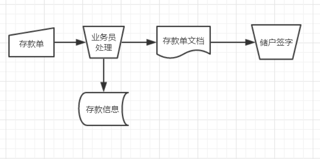
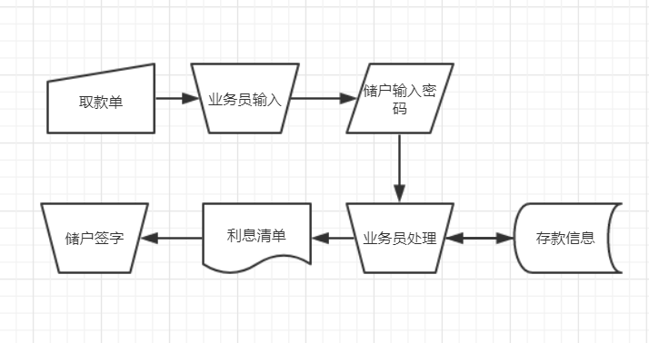
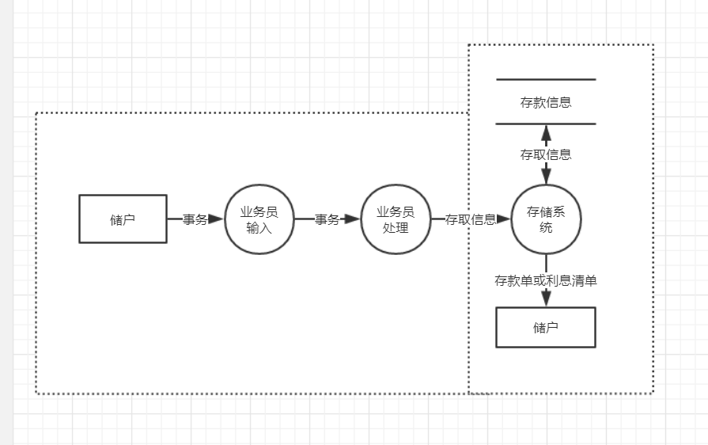
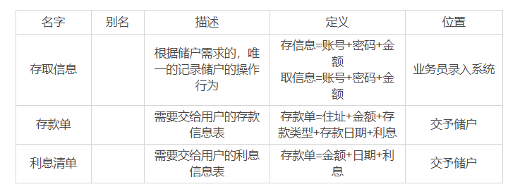

## 问题定义
* 如果是存款，储户需要填写存款单，交予业务员，业务员负责把存款单上的信息和存款人的姓名、住址、存款类型、存款日期、利率等信息录入银行系统，并且把存款单交予储户。
* 如果是取款，储户填写取款单交予业务员，业务员把取款金额输入系统并要求储户输入密码确定身份，核对密码正确无误后系统计算利息并打印出利息清单给储户。

##可行性分析
* 决定可行性的主要因素
	* 项目开发成本
	* 所需设备置办成本
	* 技术能否满足需求
	* 操作人员的熟练程度
	* 资源有效性

* 技术可行性
	* 有两种解决方法：前后端分离、前后端不分离
	* 前后端分离：前端使用Vue.js进行开发，用后端可用PHP、Java等后端语言进行开发，前后端统一开发文档、统一API文档即可。
	* 前后端不分离：使用PHP进行开发，耗时比较长，比较节省经济和时间。
* 经济可行性
	* 预计系统的经济效益能够超过它的开发成本。
	* 系统方便了用户，方便了业务员，提高了服务效率，记录可以达到长期存储。
* 操作可行性
	* 该系统面向的是银行业务员，业务员只需要了解了过程之后就会驾轻就熟。

## 原型图演示Demo
[https://free.modao.cc/app/preview/pk0ndvs1kwmiq50sg](https://free.modao.cc/app/preview/pk0ndvs1kwmiq50sg)

## 系统流程图
* 存款流程图

* 取款流程图

## 系统数据流图

## 数据字典

