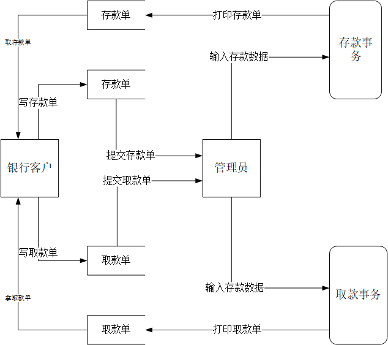
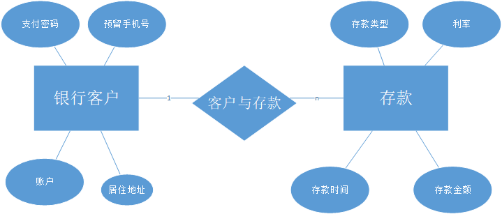

# 一、	任务概述    #
## 1.	目标   ##
利用计算机网络，数据库和一定的硬件资源开发一个银行计算机存储系统，使用计算机的方式，提高银行的业务效率和业务的准确性，并且节省一部分人力成本。  
## 2.	用户特点   ##
银行的计算机存储系统的使用和管理全部由银行的管理员来承担，客户只需向业务员提交数据即可，也就是说系统的真实操作者是银行管理员，他们是拥有管理客户账户， 甚至修改利率权限的人。
## 3.	需求概述   ##
银行存储系统为管理员提供银行管理服务，并由业务员向客户提供存储款的服务，所以该系统应该具有办公一体化，业务修改，业务查询的功能。!
## 4.	数据流图    ##

# 二、	数据成员   #
## 1.	静态数据   ##
系统登录账号，密码  
## 2.	动态数据   ##
存款业务：  
客户的地址，姓名，存款类型，存款年份，账户  
取款业务：  
客户姓名，住址，账号，预留手机号，支付密码，取款金额  
## 3.	E-R图   ##

