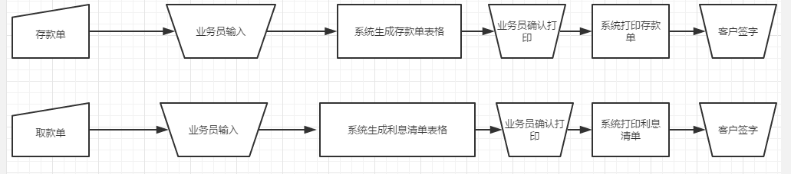
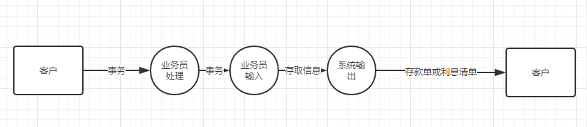

问题定义：
	存款业务：客户填写好存款单，由业务员将存款单上的信息，输入到
	系统里面，然后由系统将存款单打印出来。
	取款业务：客户填写好取款单，然后交给业务员，由业务员将取款单的相关信息输入到系统里面，然后由系统打印出这个利息清单。

可行性分析：
	技术层次:现有的技术实现这个系统并不困难，但是为了快速满足客户的需求，在很短的时间之类，对用户的信息作出，最快的处理，所以就需要很大的主存容量以及强大的数据库支持。
	经济层次：开发成本的主要是对于数据库性能的提升和对数据库的维护
	刚开始可能开发成本难以回本，但是这个系统一般要使用几年，长时间的使用，经济效益还是大于这个开发成本。
	操作层次：操作方面较为简单，业务员可以很快上手，所以系统的操作方式在用户组织是行得通的。

系统流程图：

系统数据流图：
